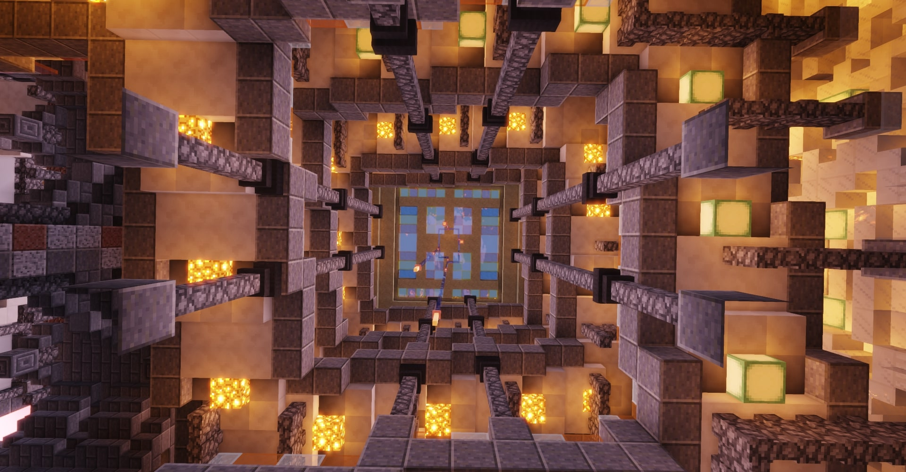
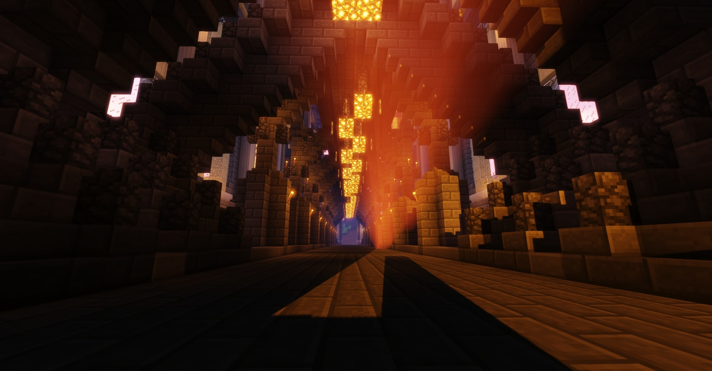
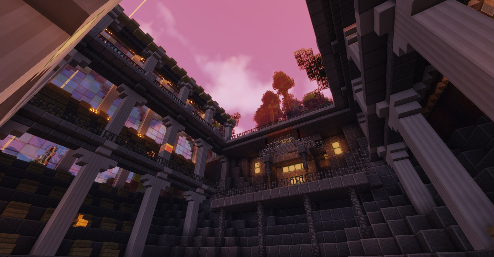

<html>
 <head> 
  <meta charset="utf-8" /> 
  <title>欢迎来到Minecraft Paty Server官方网站！</title> 
  <meta name="viewport" content="width=device-width, initial-scale=1" /> 
  <!--[if lte IE 8]><![endif]--> 
  <link rel="stylesheet" href="assets/css/main.css" /> 
  <!--[if lte IE 8]><link rel="stylesheet" href="assets/css/ie8.css" /><![endif]--> 
  <!--[if lte IE 9]><link rel="stylesheet" href="assets/css/ie9.css" /><![endif]--> 
 </head> 
 <body class="landing"> 
  <!-- Page Wrapper --> 
  
 
   <!-- Header --> 
   <header id="header" class="alt"> 
    <h1><a href="index.html">Minecraft Paty Server</a></h1> 
   </header> 
   <!-- Banner --> 
   <section id="banner"> 
    
 
     <h2>Minecraft Paty Server</h2> 
     
这里是Minecraft Paty Server GF!  YALLAGE  
 
    
 
    <a href="#one" class="more scrolly">了解更多</a> 
   </section> 
   <section id="one" class="wrapper style1 special"> 
    
 
     <header class="major"> 
      <h2>1  2</h2> 
      
3  4
 
     </header> 
    
 
   </section> 
   <section id="two" class="wrapper alt style2"> 
    <section class="spotlight"> 
     

      
     

     
 
      <h2>5  </h2>6 
      
7  8  9  10  11
 
     
 
    </section> 
    <section class="spotlight"> 
     

      
     

     
 
      <h2>12 </h2> 
      
13  14  15
 
     
 
    </section> 
    <section class="spotlight"> 
     

      
     

     
 
      <h2>16  17</h2> 
      
18  19  19
 
     
 
    </section> 
   </section> 
   <!-- Three --> 
   <section id="three" class="wrapper style3 special"> 
    
 
     <header class="major"> 
      <h2>20</h2> 
      
我们的开服配置：CPU：E5 2600v4 4核 运行内存：8G
 
      
有疑问反馈或漏洞反馈可以通过邮箱联系我们服主
 
      
服主的邮箱：haizhongdelan@outlook.com
 
      
发现漏洞服务器会给予您相应奖励

      
欢迎加入我们服务器的官方QQ群以获得最新服务器消息

      
服务器官方QQ群号：1071299010

      
服务器为纯净生存服务器

      
服务器未开正版验证

     </header> 
    
 
   </section> 
   <!-- CTA --> 
   <section id="cta" class="wrapper style4"> 
    
 
     <header> 
      <h2>Minecraft Paty Server</h2> 
      
服务器IP多线地址:Play.PatyServer.xyz
 
      
服务器版本:新1.16.4
 
      
服务器绝不会容忍任何一个作弊、破坏他人游戏体验的人，我们将对此人进行封禁处理
 
      
在此我们欢迎您的到来
 
     </header> 
     <ul class="actions vertical"> 
      <li><a href="https://patyserver.github.io/" class="button fit special">回到顶部</a></li>
      <li><a href="http://Status.Mctalks.com/id-3878.html" class="button fit special">服务器在线状态检测</a></li>
      <li><a href="http://GF.PatyServer.xyz:8888/down/NwjtXJVg5A42" class="button fit special">服务器客户端下载</a></li>
      <li><a href="http://PatyServer.Github.io/images/Paty服务器指南.txt" class="button fit special">服务器指南下载</a></li>
      <li><a href="http://PatyServer.Github.io/Banlist.html" class="button fit special">封禁查询</a></li>
      </ul> 
    
 
   </section>  
  
 
  <!-- Scripts --> 
   
   
   
   
   
  <!--[if lte IE 8]><![endif]--> 
    
  <audio src="images/bgm001.mp3" autoplay="autoplay" loop="loop">   
 </body>
</html>
